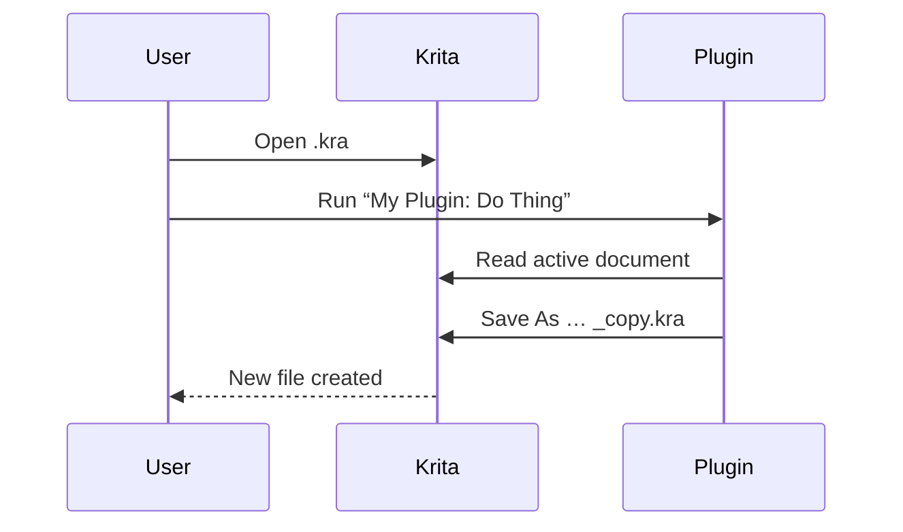

# KritaPlugins
Plugins to spark illustration
In this repository, you will find useful Plugins for enhancing the features provided by the open-source application Krita
# Krita Plugin – Starter Template & File Format Guide


<p align="center">
  <a href="#requirements"></a>
  <a href="#installation"></a>
  <a href="LICENSE"></a>
</p>

> **What is this?** A ready‑to‑use README you can drop into a GitHub repo for a Krita plugin. It explains how to install, use, and develop the plugin **and** gives a high‑level, practical overview of how **Krita files (.kra)** are structured.

---

## Table of Contents

* [Overview](#overview)
* [Requirements](#requirements)
* [Installation](#installation)
* [Usage](#usage)
* [How Krita Files (.kra) Work](#how-krita-files-kra-work)

  * [Visual: What’s Inside a .kra](#visual-whats-inside-a-kra)
  * [Best Practices When Saving](#best-practices-when-saving)
* [Plugin Anatomy](#plugin-anatomy)
* [Development](#development)
* [Troubleshooting](#troubleshooting)
* [FAQ](#faq)
* [Contributing](#contributing)
* [License](#license)

---

## Overview

This repository contains a Krita plugin (Python) plus documentation. Use it as a starter or adapt the README for your own project. The plugin adds a sample action to Krita’s menu and demonstrates reading/writing document data safely.

> **Heads‑up:** This doc targets **Krita 5.x+**. Features and paths can vary by OS and Krita version.

---

## Requirements

* Krita **5.x or later**
* Python environment bundled with Krita (no separate install required)
* OS: Windows, macOS, or Linux

---

## Installation

### Quick Install (User)

1. Download the release **.zip** from the [Releases](./releases) page.
2. In **Krita**: `Tools → Scripts → Import Python Plugin…` and choose the zip.
3. Restart Krita.
4. Enable the plugin: `Settings → Configure Krita… → Python Plugin Manager` → check this plugin → **OK** → restart if asked.

### Manual Install (Advanced)

Copy the plugin folder into your user plug‑ins directory and restart Krita.

* **Windows**: `%APPDATA%/krita/pykrita/`
* **Linux**: `~/.local/share/krita/pykrita/`
* **macOS**: `~/Library/Application Support/krita/pykrita/`

The folder should contain at least a `*.desktop` file and a Python package folder.

---

## Usage

After enabling, find the menu item at: `Tools → Scripts → <Your Plugin Name>`.

* **Demo action:** Pops a dialog, reads the active document, and (optionally) saves a copy.
* **Safe mode:** The plugin never overwrites your file without asking.

> Tip: Map a shortcut via `Settings → Configure Krita… → Keyboard Shortcuts` for quick access.

---

## How Krita Files (.kra) Work

Krita saves artwork in **`.kra`** files. A `.kra` is essentially a **ZIP package** that stores your canvas data, layers, metadata, and thumbnails in a structured way so that complex paintings remain editable.

**At a glance:**

* **Container:** `.kra` = zipped bundle.
* **Document description:** XML/metadata describing the canvas (size, color space, layers tree, etc.).
* **Layer data:** Saved as lossless image data per layer (including masks, groups, and blending info) so you can re‑edit.
* **Extras:** Thumbnails/previews, embedded resources (e.g., color palettes), and document settings.

> This is a **high‑level view** intended for artists and plugin devs. The exact internal filenames and XML schemas can change between versions; write plugins against Krita’s Python API rather than parsing `.kra` contents directly.

### Visual: What’s Inside a .kra

```mermaid
flowchart TD
    A[my-art.kra]:::kra --> B[ZIP container]
    B --> C[Document XML & metadata]
    B --> D[Layers & masks (lossless images)]
    B --> E[Preview / thumbnail]
    B --> F[Project settings / extras]

classDef kra fill:#7FFFD4,stroke:#2C7A7B,color:#053b3d,stroke-width:2px;
```

### Best Practices When Saving

* **Keep a `.kra` master** for editing; export to `.png`/`.jpg` for sharing.
* Enable **backup copies** (`Settings → Configure Krita → General → File Handling`).
* For huge canvases, consider **file compression** options in `File → Save As…` dialogs to balance size vs speed.
* Avoid manual unzipping/repacking `.kra` unless you know what you’re doing—use the **Krita API**.

---

## Plugin Anatomy

A minimal Krita plugin has two parts:

```
my_plugin/
├─ my_plugin.desktop        ← plugin manifest (name, menu entry, main module)
└─ my_plugin/               ← Python package
   ├─ __init__.py           ← registers actions with Krita
   └─ ui.py                 ← optional: dialogs, widgets
```

**Example `.desktop` (manifest)**

```ini
[Desktop Entry]
Type=Service
ServiceTypes=Krita/PythonPlugin
X-KDE-Library=my_plugin
X-Python-2-Compatible=false
X-Krita-Manual=README.md
Name=My Plugin
Comment=Example plugin demonstrating menu action and document access
```

**Example `__init__.py`**

```python
from krita import Krita, Extension

class MyExtension(Extension):
    def __init__(self, parent):
        super().__init__(parent)

    def setup(self):
        pass  # called on Krita startup

    def createActions(self, window):
        action = window.createAction("my_plugin_action", "My Plugin: Do Thing")
        action.triggered.connect(self.run)

    def run(self):
        app = Krita.instance()
        doc = app.activeDocument()
        if not doc:
            Krita.instance().notifier().showMessage("No document open")
            return
        # Example: duplicate current document to a new .kra path
        new_path = doc.fileName().replace('.kra', '_copy.kra') if doc.fileName() else ''
        if new_path:
            doc.saveAs(new_path)

Krita.instance().addExtension(MyExtension(Krita.instance()))
```

> **Safety note:** Use Krita’s API for saving/duplicating. Avoid manipulating `.kra` internals yourself.

---

## Development

### Run from source

1. Clone your repo.
2. Symlink or copy the plugin folder into your `pykrita` directory (see paths above).
3. Start Krita → enable the plugin.

### Logging & Debugging

* Open `Settings → Dockers → Python Scripter` for an interactive console.
* Use `print()` while developing; messages show in Krita’s Python docker.
* For persistent logs, write to a file in your user data directory.

### Versioning & Releases

* Tag releases in Git and attach a ZIP of the plugin folder.
* Keep this README and your `CHANGELOG.md` updated.

---

## Troubleshooting

| Symptom               | Possible Cause                   | Fix                                                        |
| --------------------- | -------------------------------- | ---------------------------------------------------------- |
| Plugin doesn’t appear | Not enabled or wrong path        | Enable in **Python Plugin Manager**; check `pykrita/` path |
| Action is greyed out  | No document open                 | Open/create a document first                               |
| Save fails            | Insufficient permissions or path | Try another folder; avoid network paths                    |
| `.kra` won’t open     | Corrupted zip                    | Restore from backup; avoid editing internals               |

---

## FAQ

**Q: Can I read layer pixels directly from a `.kra`?**
A: Use Krita’s Python API to access layers and pixel data. Parsing the ZIP yourself is brittle and version‑dependent.

**Q: What’s the best export format for web?**
A: **PNG** for transparency or crisp lines; **JPEG** for photos. For animation, use **WebM**/**MP4** via Krita’s render/export tools.

**Q: Does this plugin work on portable Krita?**
A: Yes—point the portable profile to a `pykrita/` folder and install the plugin there.

---

## Visuals

* `docs/header-banner.png` – repo banner (1200×300 suggested)
* `docs/screenshot-menu.png` – plugin menu location
* `docs/screenshot-dialog.png` – example dialog/action



---

## Contributing

PRs welcome! Please:

1. Open an issue describing the change.
2. Keep code PEP 8‑ish and include short docstrings.
3. Add screenshots for UI changes.

---


MIT © David Lin Wang
